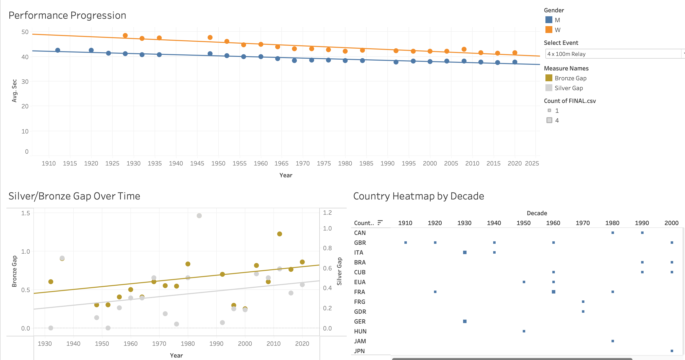
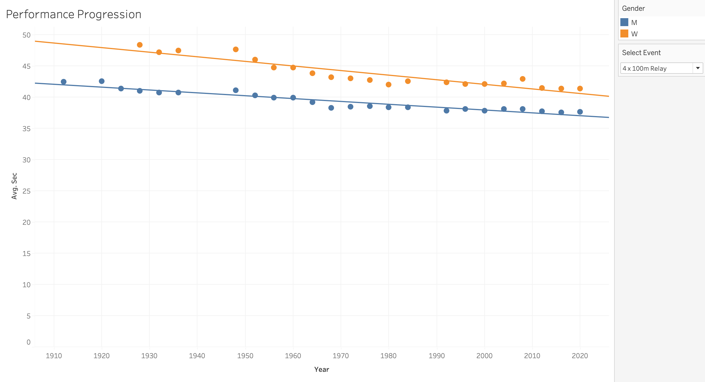
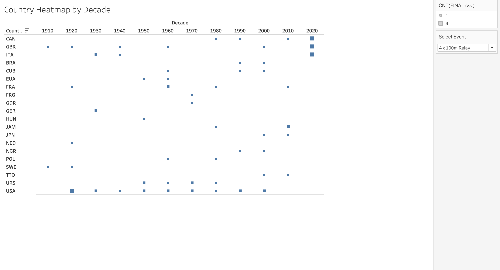
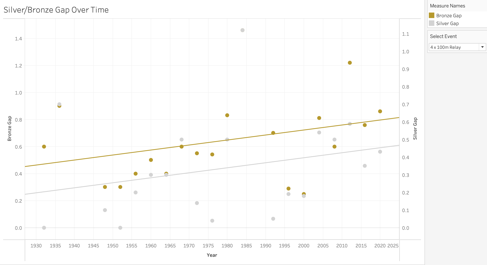

# Olympic Track & Field Performance Trends (1896–2024)

An end-to-end data analytics project exploring over 120 years of Olympic Track & Field medalists. This study evaluates historical competitiveness, country specialization, gender performance gaps, and relative event improvements over time.

---

## Project Overview
Using combined data from three separate historical datasets, this project addresses key questions surrounding Olympic Track & Field evolution:
* **Competitiveness:** Is the performance gap between Gold, Silver, and Bronze medalists narrowing over time?
* **Performance Progression:** How have athletic performances evolved since 1896, and how has the gender performance gap shifted?
* **Country Specialization:** Which nations dominate specific event categories (Sprints, Distance, Field), and how have these trends shifted across decades?
* **Relative Improvement:** Which Olympic events have seen the highest percentage improvement from their inaugural year to 2024?

---

## Key Findings

* **Overall Progression & Gap Reduction:** Performance across nearly all Track & Field events has steadily improved over time, with the gap between Gold, Silver, and Bronze medalists generally tightening.
* **Country Specialization Shifts:** While the U.S. demonstrates overall dominance in Track & Field, nations like Kenya and Ethiopia hold significant specialization in distance events (1500m, 5000m, 10,000m, Marathon).
* **Top Improved Event:** The **Men's Marathon** experienced the largest relative performance gain (~39.5%) between its first Olympic appearance and 2024.
* **Gender Gap:** Across most running events, the relative performance gap between male and female medalists has remained remarkably consistent since women's events were introduced mid-20th century.

---

## Visual Highlights

### Interactive Dashboard Preview


### Performance Progression Across Events


### Country Heatmap By Decade


### Silver/Bronze Gap Over Time


---

## Dashboard & Interactive Visualizations

* **Live Interactive Dashboard:** [Explore Olympic Visualizations on Tableau Public](https://public.tableau.com/app/profile/olivia.sze/viz/olympic-visualizations/PerformanceProgression#1)

---

## Tech Stack & Methodology

### Data Preparation & Pipeline
* **Sources:** Combined a historical Kaggle dataset (1896–2016) with updated datasets for Tokyo 2020 and Paris 2024.
* **Tableau Prep:** Executed data joins, unions, column standardization, and string cleaning across distinct datasets.
* **Feature Engineering:** Calculated a standardized time metric (`sec`) to resolve formatting discrepancies across colon/period time representations, and engineered `Gold Gap` and `Silver Gap` variables.

### Data Analysis & Visualization
* **Python (Pandas):** Handled complex data grouping, filtering by distance/sprint/field event classifications, and percentage improvement calculations across time endpoints.
* **Tableau Desktop Public:** Designed interactive scatter plots with regression trend lines and decade-by-decade heatmaps.

---

## Repository Structure

```text
olympic-track-and-field-analysis/
├── README.md                 <-- Executive summary & project overview
├── data/
│   ├── raw/                  <-- Source datasets (1896-2016, 2020, 2024)
│   └── processed/            <-- Standardized & merged dataset
├── notebooks/
│   └── olympic_analysis.ipynb <-- Pandas data aggregation & analysis code
├── tableau/
│   └── olympic_prep.tfl <-- Packaged Tableau workbook
│   └── olympics_visualizations.twbx <-- Tableau prep flow
└── docs/
    └── olympic_summary.pdf <-- Comprehensive written project report
    └── olympic_presentation.pptx <-- Comprehensive written project report
    └── *.png                 <-- Dashboard screenshots & visual assets
```

---

## Business & Analytical Takeaways

### 1. Data Cleaning Rigor & Edge Case Management
* **Technology & Timing Shifts:** Historical records prior to the 1970s relied on hand-timed stopwatches (rounded to tenths of a second) before transitioning to fully automatic timing (FAT) measured in hundredths. Normalizing these across 120+ years required careful schema standardization to prevent artificial performance jumps.
* **Accounting for Historical Context:** Events impacted by major geopolitical disruptions (e.g., the 1980 and 1984 Olympic boycotts) or evolving equipment rules required contextual interpretation rather than treating outliers as pure measurement error.

### 2. Statistical Nuance in Growth Metrics & Limitations
* **Baseline Sensitivity:** Relying strictly on first-vs-last year calculations for relative percent improvement (e.g., Men's Marathon ~39.5%) demonstrated the sensitivity of boundary-year analysis. Outlier inaugural performances or smaller field sizes in 1896 can skew overall growth rates, reinforcing the necessity of evaluating decade-over-decade rolling averages and regression trendlines over simple endpoints.
